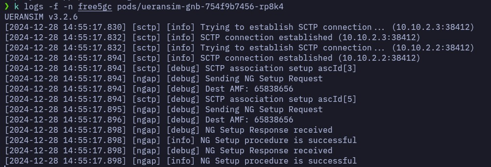
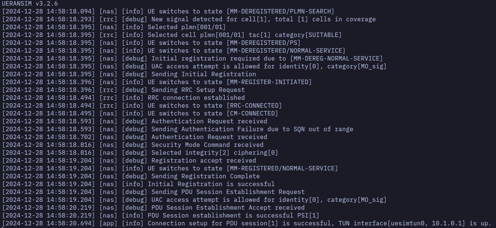
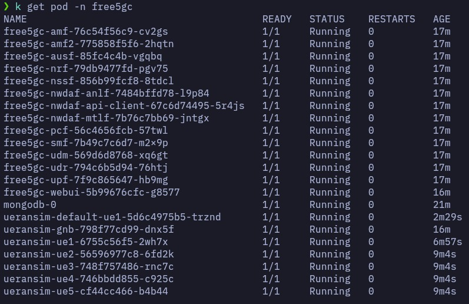
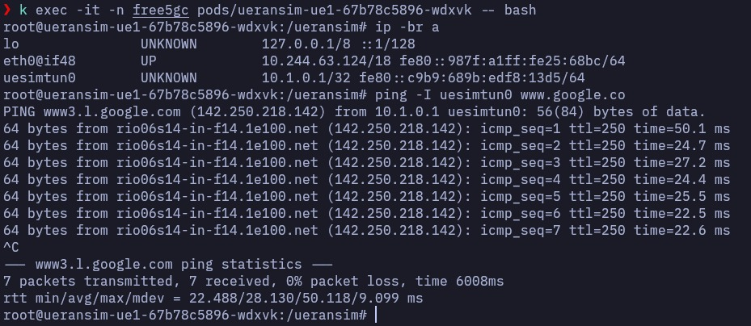

# Intelligent 5G - k8s

This repository contains the necessary files and resources to deploy and operate Intelligent 5G, an open-source 5G testebd based in [Free5GC](https://github.com/free5gc/free5gc) and [UERANSIM](https://github.com/aligungr/UERANSIM). It provides Kubernetes manifest files for deploying a NWDAF, Free5GC and UERANSIM using microservices, MongoDB database and network attachment definitions.

**Note**: The Free5GC and UERANSIM projects were modified to integrate the NWDAF. In [free5gc-vanilla](https://github.com/enable-intelligent-containerized-5g/free5gc-vanilla) you will find the source code of 5GC based on Free5GC and in uransim the modified version of [UERANSIM](https://github.com/enable-intelligent-containerized-5g/ueransim).


## Directory Structure

The repository is organized as follows:
- [bin](bin/): Contains some useful tools like installing **gpt5g**.
- [dockerfiles](dockerfiles/): Contains the dockerfiles to create the images of each of the **NWDAF**, **Free5GC** and **UERANSIM** components.
- [free5gc](free5gc/): Contains Kubernetes manifest files for deploying Intelligent 5G using a microservices architecture.
- [free5gc-webui](free5gc-webui/): Contains Kubernetes manifest files for deploying the Free5GC WebUI.
- [mongodb](mongodb/): Contains Kubernetes manifest files for deploying the MongoDB database, which is a prerequisite for deploying Intelligent 5G.
- [networks5g](networks5g/): Contains network attachment definitions for Intelligent 5G.
- [testbed-automator](testbed-automator/): Contains the files to prepare the Kubernetes cluster.
- [ueransim](ueransim/): Contains Kubernetes files for running UERANSIM-based simulated gNB and UEs.

## Deployment

**Note**: Free5GC recommends kernel version `5.4.0`. It has also been successfully tested on kernel `5.15.0-94`. Using a higher kernel version (e.g, 6.x) may result in [issues with the UPF](https://forum.free5gc.org/t/upf-est-createfar-error-invalid-argument/2111). 

**Note**: The deployment instructions assume a working kubernetes cluster with OVS CNI installed. You can optionally use the [testbed-automator](testbed-automator/) directory to prepare the Kubernetes cluster. This includes creating the VM, setting up the K8s cluster, configuring the cluster, installing various Container Network Interfaces (CNIs), configuring OVS bridges, and preparing for the deployment of the 5G Core network.

(optional) Create a free5gc context and set it as default.

```
kubectl create ns free5gc
kubectl config view # See the kubectl config.
kubectl config current-context # See the actual context.
kubectl config set-context <context-name> --namespace=<namespace-name> --cluster=<cluster-name> --user=<user-name> # Create a new context.
kubectl config use-context <context-name> # Set teh new context as default. 
```

To deploy Intelligent 5G and its components, follow the deployment steps below:

1. Set up OVS bridges. On each K8s cluster node, add the OVS bridges: n2br, n3br, and n4br. Connect nodes using these bridges and OVS-based VXLAN tunnels. See [ovs-cni docs](https://github.com/k8snetworkplumbingwg/ovs-cni/blob/main/docs/demo.md#connect-bridges-using-vxlan).

    <details>
    <summary>Example command for creating VXLAN tunnels</summary>

    ```bash
    sudo ovs-vsctl add-port n2br vxlan_nuc1_n2 -- set Interface vxlan_nuc1_n2 type=vxlan options:remote_ip=<remote_ip> options:key=1002
    ```
    </details>  

    <br>

    **Note**: The testbed-automator scripts automatically configures the OVS bridges for a single-node cluster setup, and VXLAN tunnel creation is not required. For a multi-node cluster configuration, VXLAN tunnels are used for node interconnectivity.

2. Deploy the MongoDB database using the Kubernetes manifest files provided in the `mongodb/` directory. See [deploying components](#deploying-components). Wait for the mongodb pod to be in the `Running` state before proceeding to the next step.

3. Deploy the network attachment definitions using manifest files in the `networks5g/` directory. This are used for the secondary interfaces of the UPF, SMF, AMF, gNB etc.

4. Install the gtp5g kernel module for Free5GC. Use the `install-gtp5g.sh` script to install gtp5g v0.8.9 on nodes where UPF should run. This is a prerequisite for deploying the UPF. 

    ```bash
    cd bin
    sudo ./install-gtp5g.sh
    ```

5. Change the **kubernetes-monitoring** volume paths in `kubernetes-monitoring/prometheus/prometheus-pv.yaml and kubernetes-monitoring/grafana/grafana-pv.yaml` files.

6. Deploy the kubernetes-monitoring using the Kubernetes manifest files in the `kubernetes-monitoring/` directory.

5. Change the **NWDAF models** volume path in the `free5gc/nwdaf/resources/models-pv.yaml` file.

7. Deploy the 5GC components using the Kubernetes manifest files in the `free5gc/` directory. The pods should eventually be in the `Running` state.

8. Deploy the Free5GC WebUI, use the Kubernetes manifest files in the `free5gc-webui/` directory.

9. The `ueransim` directory contains Kubernetes manifest files for both gNB and UEs. First, deploy UERANSIM gNB using `ueransim/ueransim-gnb` directory and wait for NGAP connection to succeed. You should see the following in the gNB log.

    <details>
    <summary>gNB log</summary>

    

    </details>

<br>

10. Ensure correct UE subscriber information is inserted. You can enter subscription information using the web UI see [accessing the Free5GC webui](#accessing-the-free5gc-webui). Subscriber details can be found in UE config files (e.g., [ue.yaml](ueransim/ueransim-ue/default-ue1/ue.yaml)).

11. Deploy UERANSIM UEs using `ueransim/ueransim-ue/` directory. Once the UE is connected, you should see the following logs:


    <details>
    <summary>UE log</summary>

    

    </details>

    **Note**: In this same directory, automation scripts are provided. The [ue-automator.py](ueransim/ueransim-ue/ue-automator/ue-automator.py) script automatically generates Kubernetes manifests for the UEs, while the [ue-runner-automator.py](ueransim/ueransim-ue/ue-runner-automator.py) script automates the deployment of the generated UEs.


### Check successful deployment

All pods should be in the `Running` state.
<details>
<summary>Summary of all pods</summary>



</details>

<br>

You should be able to ping from the UEs.
<details>
<summary>Ping test</summary>



</details>

### Deploying components
We use [kustomize](https://kustomize.io/) to deploy the components.

Deploy all components in the free5gc namespace. Create the namespace if needed (`kubectl create namespace free5gc`). Use the following command for deployment, replacing <component> (e.g., mongodb, networks5g, kubernetes-monitoring, free5gc, free5gc-webui, ueransim) as needed:

```bash
kubectl apply -k <component> -n free5gc
```

### Accessing the Free5GC webui
1. Subscribers can be added using the Intelligent 5G WebUI. The WebUI is accessible at `http://<node-ip>:30505`. The default username and password are `admin` and `free5gc`, respectively.

## Convenience Scripts
Some convenience scripts are available in the `bin` folder:
- **k8s-log.sh:** Use this script to view logs of a specific pod in a specific namespace. For example:
  ```bash
  ./k8s-log.sh amf free5gc
  ```
  Ensure the K8s namespace is specified (e.g., free5gc).

- **k8s-shell.sh:** Use this script to open a shell in a specific pod in a specific namespace. For example:
  ```bash
  ./k8s-shell.sh amf free5gc
  ```

- **install-gtp5g.sh**: Use this script to install gtp5g v0.8.2 on nodes where UPF should run.
  ```bash
  sudo ./install-gtp5g.sh
  ```

## Troubleshots

- no IP addresses available in range set:

  ```sh
  sudo su
  cd /var/lib/cni/networks/cbr0
  ls
  ```

  And delete folders named after IPs not used by pods. To see de IPs, run `kubectl get po -A -o wide`

- pod no running:

  ```sh
  for pod in $(kubectl get pods -n free5gc); do kubectl logs $pod -n free5gc -f; done
  ```

  See the error and fix the problem.

- kubectl with sudo.

  Run the following commands from the create-k8s-cluster() section of [testbed-automator/install.sh](testbed-automator/install.sh).

  ```sh
  # Setup kubectl without sudo
  mkdir -p $HOME/.kube
  sudo cp -i /etc/kubernetes/admin.conf $HOME/.kube/config
  sudo chown $(id -u):$(id -g) $HOME/.kube/config
  ```

  Or 
  
  Run `bash uninstall.sh` and `bash install.sh`

- "Failed to set bridge addr: "cni0" already has an IP address different from 10.244.0.1/18" in tesbet automator.

  ```bash
  sudo ip link delete cni0
  bash uninstall.sh
  bash install.sh
  ```

## License

This repository is licensed under the [MIT License](LICENSE).


<!-- ## Citation -->

<!-- If you use the code in this repository in your research work or project, please consider citing the following publication. -->

<!-- > INTELLIGENT 5G -->

<!-- > N. Saha, A. James, N. Shahriar, R. Boutaba and A. Saleh. (2022). Demonstrating Network Slice KPI Monitoring in a 5G Testbed. In Proceedings of the IEEE/IFIP Network Operations and Management Symposium (NOMS). Budapest, Hungary, 25 - 29 April, 2022. -->
